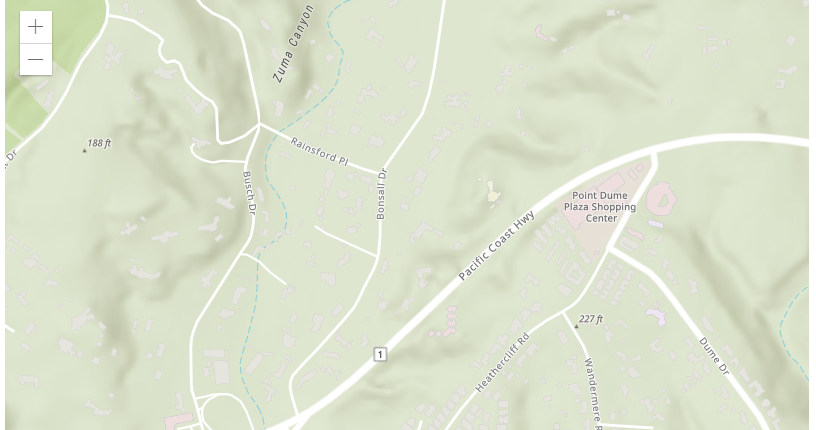

<!--
 * @Author: your name
 * @Date: 2019-11-08 14:34:50
 * @LastEditTime: 2019-11-08 14:49:05
 * @LastEditors: Please set LastEditors
 * @Description: In User Settings Edit
 * @FilePath: \gis_zh_cn\README.md
 -->
# gis_zh_cn
gis中文教程

[英文原文](https://developers.arcgis.com/javascript/latest/guide/quick-start/)

## 1.注册ArcGIS for Developers（免费）
为了使用ArcGIS API for JavaScript，您应该注册一个ArcGIS Developer帐户。除了能够访问所有ArcGIS API和SDK之外，您的订阅还为您提供：

+ 访问ArcGIS Online和ArcGIS for Developers网站上的工具。
+ 每月将获得50个服务信用，以开发诸如路由和地理编码之类的服务。
+ 我们论坛上的社区支持。

[注册ArcGIS for Developers](https://developers.arcgis.com/sign-up/)

## 2.设置本地开发环境
尽管您可以使用JS Bin，CodePen和我们自己的沙箱之类的网站来试用ArcGIS API for JavaScript，但我们强烈建议您使用代码编辑器和Web服务器设置本地开发环境。我们推荐下面的代码编辑器，虽然任何编辑器将工作：

VS代码
原子
崇高文字
Mozilla开发人员网络在设置本地开发服务器方面提供了出色的指南。

## 3. Hello World

>
无法添加画布，详情请查看[链接](https://developers.arcgis.com/javascript/latest/guide/quick-start/)

```html
<html>
<head>
  <meta charset="utf-8">
  <meta name="viewport" content="initial-scale=1, maximum-scale=1, user-scalable=no">
  <title>ArcGIS API for JavaScript Hello World App</title>
  <style>
    html, body, #viewDiv {
      padding: 0;
      margin: 0;
      height: 100%;
      width: 100%;
    }
  </style>

  <link rel="stylesheet" href="https://js.arcgis.com/4.13/esri/css/main.css">
  <script src="https://js.arcgis.com/4.13/"></script>

  <script>
    require([
      "esri/Map",
      "esri/views/MapView"
    ], function(Map, MapView) {

      var map = new Map({
        basemap: "topo-vector"
      });

      var view = new MapView({
        container: "viewDiv",
        map: map,
        center: [-118.71511,34.09042],
        zoom: 11
      });

    });
  </script>
</head>
<body>
  <div id="viewDiv"></div>
</body>
</html>
```

## 4.继续学习
如果您刚刚开始使用ArcGIS API for JavaScript，我们建议您完成一些教程，以获取学习API的指导方法。查看核心概念以了解API的基础知识，或浏览代码示例以查找API可以做什么的特定示例。

----------------------
[原文链接](https://developers.arcgis.com/javascript/latest/guide/quick-start/)


[下一篇]()